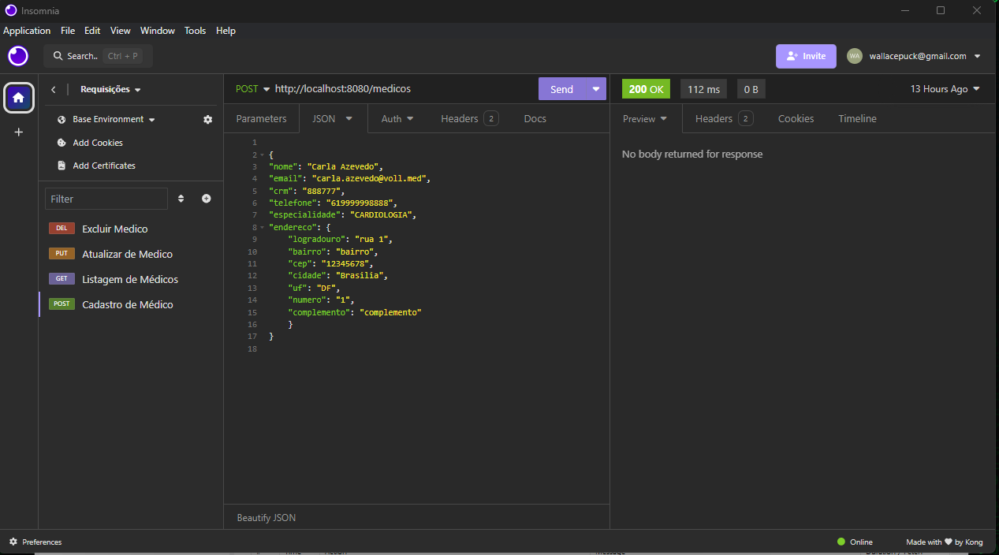
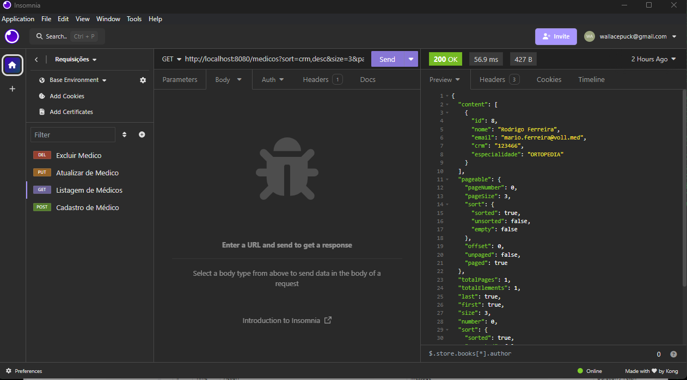
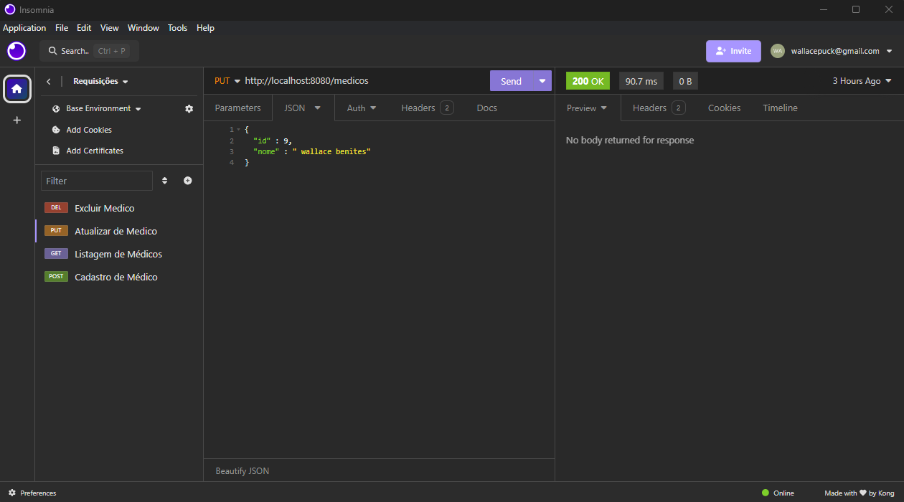
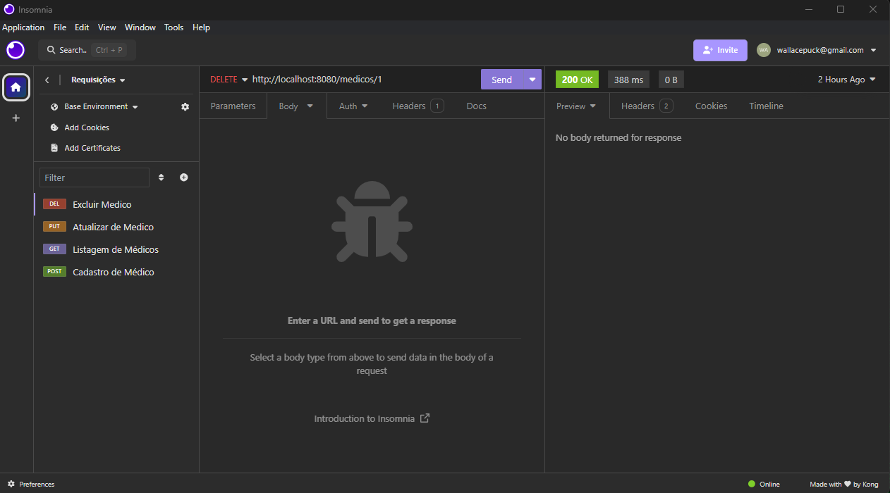

# Vollmed | Pojeto de Estudo - Spring Boot 3  

---
## Sobre o Projeto
- Projeto de Estudos para aprender usar Spring Boot 3 e desenvolver uma API Rest em java 
- Criando um CRUD completo com foco somente no Beck-end
- Cadastrando Médicos e Pacientes no Banco de dados
- Não é um projeto completo, e nem é a intenção, é só para estudo
 ## Principais tecnologias utilizadas
````
Java - Spring Boot 3 - API Rest - Maven - MySQL  

````
Imagem Previa  
---
- como o Foco é no Back-end, segue as imagens dos testes do CRUD pelo Insomnia

 ♦ Teste Create
<p align="center" >
     
</p>
♦ Teste Read 
<p align="center" >
     
</p>
♦ Teste Update  
<p align="center" >
     
</p>
♦ Teste Delete  
<p align="center" >
     
</p>
